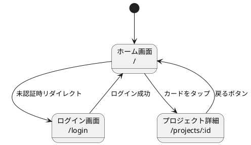

# tespec 画面仕様定義 設計書

画面単位で「操作 × 期待値」を YAML で定義し、テスト生成・遷移図生成・ステータス管理を行う仕組み。

---

## 1. コンセプト

### 解決する課題

| 課題 | 解決策 |
|---|---|
| E2E テストを後付けで書くと漏れが出る | 画面ごとに操作と期待値を先に定義する |
| 各画面で何をテストすべきか不明確 | screen YAML が画面の仕様書になる |
| 正常系だけテストして異常系が手薄 | `type: error / boundary` で明示的に分類 |
| 共通の前提条件（ログイン等）を毎回書く | setup ファイルで共通化 |
| 画面遷移の全体像が見えない | `navigates_to` から遷移図を自動生成 |
| テストの実装状況が分からない | `.status.json` で自動追跡 |

### 設計原則

- **YAML が正本**: 画面の仕様は YAML に書く。テストコードは YAML から導出される
- **画面ファースト**: 遷移より先に「各画面でできること」を定義する
- **ミニマム記述**: `action` + `expect` の2フィールドだけで1ケース書ける。他は全て任意
- **仕様と状態の分離**: YAML は仕様のみ。テスト結果は `.status.json` に自動管理

---

## 2. ファイル構成

```
docs/tespec/
├── config.yaml              # プロジェクト設定
├── setups/                  # 共通前提条件
│   ├── auth.yaml
│   └── seed-data.yaml
├── screens/                 # 画面ごとの仕様（1画面1ファイル）
│   ├── home.yaml
│   ├── login.yaml
│   └── project_detail.yaml
└── .status.json             # テスト実行結果（自動生成、gitignore 推奨）
```

---

## 3. YAML スキーマ

### 3.1 Screen ファイル (`screens/*.yaml`)

各画面の仕様を定義する。1画面1ファイル。

```yaml
screen: home
route: "/"
title: "ホーム画面"
cases:
  - action: "画面を開く"
    expect: "プロジェクト一覧が表示される"
```

**Screen フィールド:**

| フィールド | 必須 | 型 | 説明 |
|---|---|---|---|
| `screen` | yes | string | ユニーク ID（ファイル名と一致） |
| `route` | yes | string | URL パス（例: `/`, `/projects/:id`） |
| `title` | yes | string | 人間向けの画面名 |
| `cases` | yes | Case[] | この画面のテストケース |

### 3.2 Case（テストケース）

各画面内の操作と期待値のペア。

**Case フィールド:**

| フィールド | 必須 | 型 | デフォルト | 説明 |
|---|---|---|---|---|
| `action` | **yes** | string | — | ユーザーの操作（WHEN） |
| `expect` | **yes** | string \| string[] | — | 期待する結果（THEN） |
| `given` | no | string \| string[] | なし | 前提条件（GIVEN）。setup ID or 自由テキスト |
| `target` | no | string | なし | 操作対象の UI 要素 |
| `type` | no | `normal` \| `error` \| `boundary` | `normal` | ケースの種別 |
| `not_expect` | no | string[] | なし | 起きてはいけないこと |
| `navigates_to` | no | string | なし | 遷移先の screen ID（遷移図生成に使用） |

**BDD (GIVEN/WHEN/THEN) との対応:**

| BDD | YAML フィールド | 説明 |
|---|---|---|
| GIVEN | `given` | 前提条件・事前状態 |
| WHEN | `target` + `action` | 何を・どうする |
| THEN | `expect` | 期待する結果 |
| THEN NOT | `not_expect` | 起きてはいけないこと |

### 3.3 Setup ファイル (`setups/*.yaml`)

共通の前提条件を定義する。case の `given` から ID で参照。

```yaml
setup: logged_in
title: "ログイン済み状態"
steps:
  - "テストユーザーでログイン"
```

**Setup フィールド:**

| フィールド | 必須 | 型 | 説明 |
|---|---|---|---|
| `setup` | yes | string | ユニーク ID（case の `given` から参照） |
| `title` | yes | string | 人間向けの説明 |
| `steps` | yes | string[] | setup の手順 |

### 3.4 Config ファイル (`config.yaml`)

```yaml
version: 1
project: "my-project"
screens_dir: "./screens"
setups_dir: "./setups"
```

---

## 4. 記述例

### 4.1 ミニマム記述

`action` + `expect` だけで書ける。

```yaml
screen: login
route: "/login"
title: "ログイン画面"
cases:
  - action: "画面を開く"
    expect: "メールアドレスとパスワードのフォームが表示される"
  - action: "ログインボタンをタップ"
    expect: "ホーム画面に遷移する"
    navigates_to: "home"
```

### 4.2 フル記述

全フィールドを使った例。

```yaml
screen: home
route: "/"
title: "ホーム画面"
cases:
  # --- 正常系 ---
  - given: "logged_in"
    action: "画面を開く"
    expect:
      - "プロジェクト一覧が表示される"
      - "ナビゲーションバーにユーザー名が表示される"

  - given:
      - "logged_in"
      - "プロジェクトが3件ある"
    target: "プロジェクトカード"
    action: "タップ"
    expect:
      - "プロジェクト詳細画面に遷移する"
      - "選択したプロジェクトの情報が表示される"
    not_expect:
      - "他のプロジェクトの情報が混在する"
    navigates_to: "project_detail"

  - target: "新規作成ボタン"
    action: "タップ"
    expect:
      - "作成ダイアログが表示される"
      - "フォームが空の状態で表示される"
      - "背景がオーバーレイで暗くなる"

  # --- 異常系 ---
  - type: error
    given: "ネットワークオフライン"
    action: "画面を開く"
    expect:
      - "エラーメッセージが表示される"
      - "リトライボタンが表示される"
    not_expect:
      - "空の一覧が表示される"

  - type: error
    given: "未認証"
    action: "画面を開く"
    expect: "ログイン画面にリダイレクトされる"
    navigates_to: "login"

  # --- 境界 ---
  - type: boundary
    given: "プロジェクトが0件"
    action: "画面を開く"
    expect: "空状態メッセージが表示される"
    not_expect:
      - "エラーメッセージが表示される"

  - type: boundary
    given: "プロジェクトが100件"
    action: "画面を開く"
    expect:
      - "ページネーションが表示される"
      - "最初の20件が表示される"
```

### 4.3 Setup の参照

```yaml
# setups/auth.yaml
setup: logged_in
title: "ログイン済み状態"
steps:
  - "テストユーザーでログイン"

# setups/seed-data.yaml
setup: seed_projects
title: "プロジェクト3件のシードデータ"
steps:
  - "テスト用プロジェクトを3件作成"
```

```yaml
# screens/home.yaml
cases:
  - given:
      - "logged_in"         # → setups/auth.yaml を参照
      - "seed_projects"     # → setups/seed-data.yaml を参照
    action: "画面を開く"
    expect: "3件のカードが表示される"
```

---

## 5. 画面仕様の書き方ガイド

### 5.1 3つの問いで埋める

各画面に対して以下の順序でケースを洗い出す。

| 問い | → type | 例 |
|---|---|---|
| **開いたら何が見える？** | normal | 初期表示、一覧、ナビゲーション |
| **何ができる？** | normal | ボタン操作、入力、スクロール、遷移 |
| **何が壊れる？** | error / boundary | オフライン、0件、大量データ、未認証 |

### 5.2 進め方

```
1. 全画面のスケルトンを作る（screen + route + title + cases: []）
2. 正常系を全画面埋める（初期表示 + 操作）
3. navigates_to で遷移を繋ぐ → 遷移図で全体確認
4. 異常系・境界ケースを足す
```

正常系を先に全画面通すと、画面間の繋がり（navigates_to）が見えてくる。
異常系は後から足していける。

---

## 6. ステータス管理

### 仕様と結果の分離

- YAML ファイル = 仕様（何をテストするか）。人間・AI が編集する
- `.status.json` = 結果（テストが通ったか）。ツールが自動生成・更新する

YAML に status を持たせず、完全に分離する。

### .status.json の構造

```json
{
  "updatedAt": "2026-03-24T10:00:00Z",
  "screens": {
    "home": {
      "cases": [
        { "action": "画面を開く", "status": "pass" },
        { "action": "新規作成ボタンをタップ", "status": "fail", "error": "timeout" },
        { "action": "カードをタップ", "status": "not_implemented" }
      ]
    }
  },
  "summary": {
    "total": 12,
    "pass": 8,
    "fail": 1,
    "not_implemented": 3
  }
}
```

### status の値

| status | 意味 |
|---|---|
| `not_implemented` | テストコードがまだない |
| `pass` | 最後の実行で成功 |
| `fail` | 最後の実行で失敗 |

---

## 7. CLI コマンド

### `tespec status`

全画面のテスト実装状況を表示する。

```bash
npx tespec status
```

```
Screens  Cases  Pass  Fail  Not Impl
──────────────────────────────────────
home       6      3     1      2
login      3      3     0      0
detail     4      2     0      2
──────────────────────────────────────
Total     13      8     1      4

Fail:
  home: "新規作成ボタン → タップ → ダイアログが表示される"
```

### `tespec validate`

YAML の参照整合性をチェックする。

```bash
npx tespec validate
```

```
ERROR: home.yaml: given "logged_in" → setup が見つからない
ERROR: home.yaml: navigates_to "settings" → screen が見つからない
WARN:  detail.yaml: 異常系 (type: error) が 0 件
OK:    login.yaml
```

チェック項目:

| チェック | レベル |
|---|---|
| `given` の参照先 setup が存在するか | error |
| `navigates_to` の参照先 screen が存在するか | error |
| `screen` ID が重複していないか | error |
| `cases` が空でないか | warning |
| `type: error` のケースが 0 件 | warning |
| `type: boundary` のケースが 0 件 | warning |

### `tespec sync`

テスト実行結果を `.status.json` に反映する。

```bash
npx tespec sync
```

### `tespec generate`

YAML からテストスケルトンを生成する。

```bash
npx tespec generate [--screen <id>] [--dry-run]
```

---

## 8. 遷移図の自動生成

`navigates_to` フィールドから画面遷移図を PlantUML で生成する。

### 生成コマンド

```bash
npx tespec diagram [--output <path>]
```

### 生成される PlantUML



遷移は `navigates_to` + `action`（+ `given`）から自動抽出する。
guard 条件がある場合（`given` + `type: error`）は `[未認証]` のように注釈を付ける。

---

## 9. 参考

- [cc-sdd](https://github.com/gotalab/cc-sdd) — Spec-driven development。EARS 形式の GIVEN/WHEN/THEN 要件定義
- [spec-kit](https://github.com/github/spec-kit) — GitHub の SDD ツールキット。constitution.md による原則定義
- [Martin Fowler - SDD Tools](https://martinfowler.com/articles/exploring-gen-ai/sdd-3-tools.html) — SDD ツール比較
